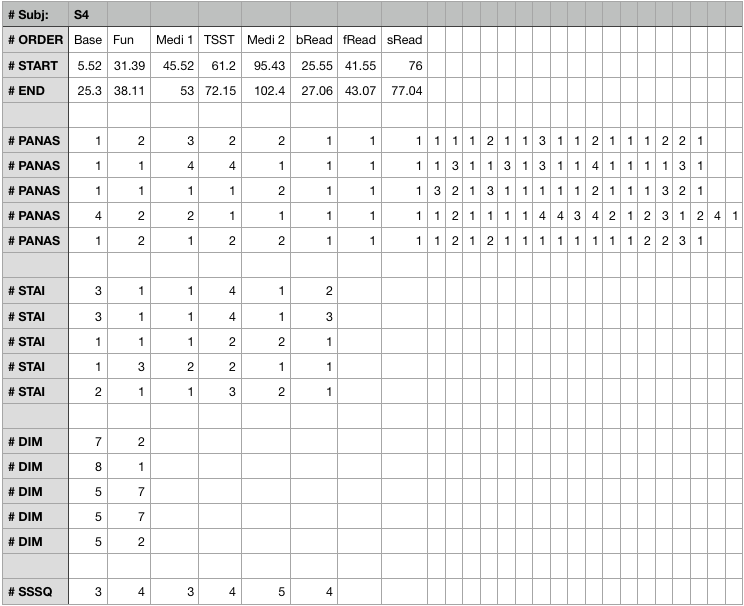

# Background

Here is detailed definition of tasks, techniques and script files which used to load and parse initial data.

#Intro
In this observation 17 subjects where participated but as stated in 
annotation ([wesad_readme.pdf](assets/wesad_readme.pdf)), due to sensor 
malfunction, data of two subjects had to be discarded 

The dataset is organised so that each subject has a folder(SX, where X = subject ID).


There are three groups of sources to be considered and thus should be grouped.

1. Information about subject itself.
Those are stored inside every subject's folder in files: SX_readme.txt and SX_quest.csv


2. Information from **RespiBAN** device stored in filr SX_respiban.txt

3. Information from **Empatica E4** device stored in folder SX_EX_Data.
(Inside every folder there is SX_SE_Data.zip file which extracted in place)


File SX.pkl contains synchronised data between two devices and is not reflected in current document.


---
Format of every file is in details explained in wesad_readme.pdf file, however it is worth to mention in brief.

#File Formats
###Subject Information

SX_readme.txt: contains information about the subject (SX) and information about data collection.
This is free form text with easy detected pattern as shown in this example:

```
### Personal information ###
Age: 25
Height (cm): 175
Weight (kg): 90
Gender: male
Dominant hand: right

### Study pre-requisites ###
Did you drink coffee today? NO
Did you drink coffee within the last hour? NO
Did you do any sports today? NO
Are you a smoker? NO
Did you smoke within the last hour? NO
Do you feel ill today? NO

### Additional notes ###
-
```

SX_quest.csv: contains all relevant information to obtain ground truth, including the protocol 
schedule for SX and answers to the self-report questionnaires. how is in picture above:




Relatively easy to parse. For detailed explanation see [wesad_readme.pdf](assets/wesad_readme.pdf)

---
### RespiBAN Device Format

File contains header lines starting with '#' symbol and the rest is 'tab' separated numbers which are
explained in details. Relatively easy to parse and clean. 
See details [here](http://www.biosignalsplux.com/en/respiban-professional).

Because of big size this file is not included in repository.

---
### Empatica E4 Device Format

Here is short instruction set from "readme" file:
```
Raw data is contained in SX_E4_Data.zip. When unzipped, the following files contain derived 
information and thus should be ignored in this dataset: HR.csv, IBI.csv, tags.csv.
The file info.txt contains some details on the folder’s content.
```

File _info.txt_ contains detailed format explanation for every .csv file.


Having this instruction those python scripts got created to parse and load data into sets for further analyses.


#Parser Files

####Parser for SX_readme.txt
As file SX_readme.txt is not a data frame but just overall information 
about subject, so regular python tools may be used to parse and collect data.
See file [readme_parser.py](parsers/readme_parser.py)

Appropriate comments made in the source code.


####Parser for SX_quest.csv

File quest.csv in reality not a data frame but unstructured source for various questions with answers.

Every type of question set should be parsed on its way.

File [quest_parser.py](parsers/quest_parser.py) is initial set of parsing and reading.